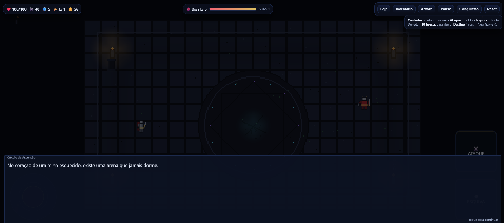
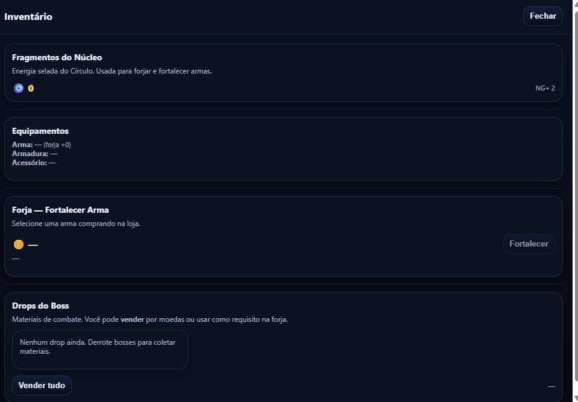
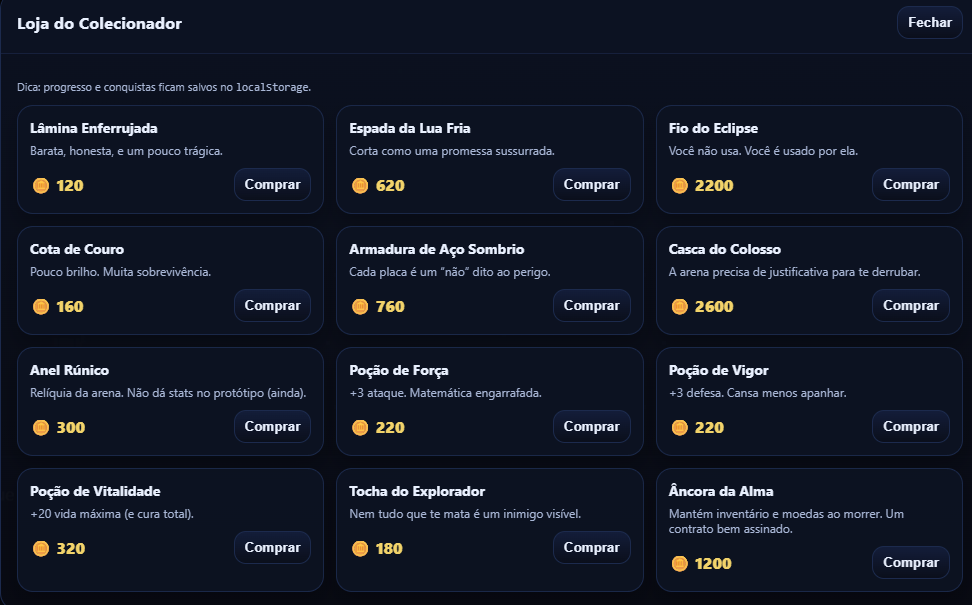
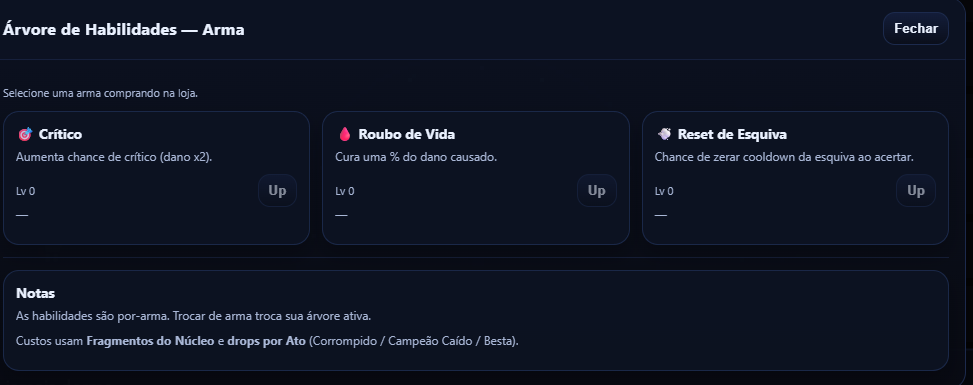
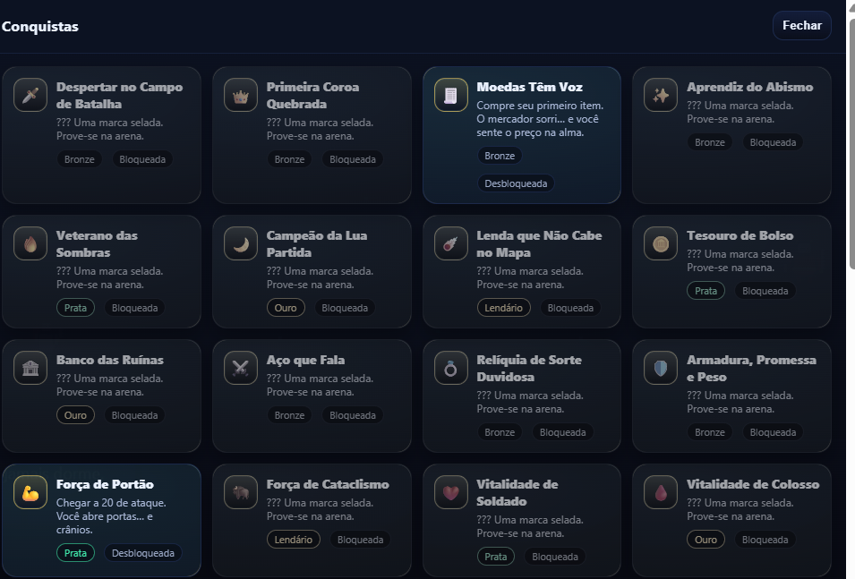
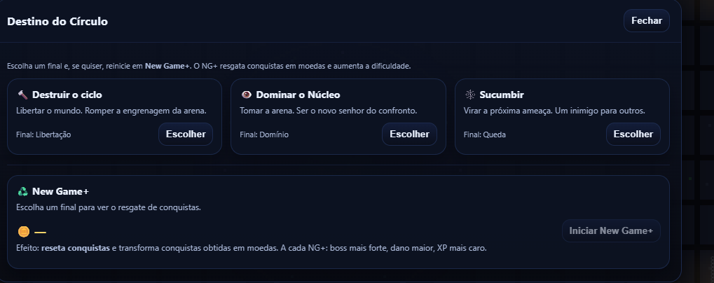

# ⚔️ O Círculo da Ascensão

> No coração de um reino esquecido, existe uma arena que jamais dorme.
> Cada golpe ecoa como uma promessa. Cada vitória cobra um preço.
> Marcado pelo Núcleo do Confronto, você foi lançado ao Círculo da Ascensão.
> Derrote seus inimigos. Recolha as Moedas de Sangraço. Torne-se mais forte.
> Mas lembre-se: aqui, todo campeão alimenta algo maior do que si mesmo.

Jogo de arena desenvolvido com **Phaser.js**, com personagem, boss, props e efeitos visuais em um único atlas. Conta com inventário, loja, sistema de habilidades, conquistas, modo New Game+ e empacotamento para Android.

---

## 📸 Screenshots

| Tela | Preview |
|------|---------|
| Tela de início |  |
| Inventário |  |
| Loja |  |
| Habilidades |  |
| Sistema de conquistas |  |
| Modo New Game+ |  |

---

## 🎮 Gameplay

- Arena de combate com **personagem jogável** e **boss** com comportamento próprio
- Sistema de **inventário** com itens e equipamentos
- **Loja** para compra de itens com moedas coletadas em batalha
- Sistema de **habilidades** ativas e passivas
- **Sistema de conquistas** baseado em eventos reais do jogo
- **Modo New Game+** com dificuldade e recompensas escaladas
- Efeitos visuais e partículas renderizados via atlas único

---

## 🚀 Como rodar

Como o projeto usa módulos ES, execute em ambiente local com Vite:

```bash
npm install
npm run dev
```

Acesse em:

```
http://localhost:5173
```

Para gerar o build de produção:

```bash
npm run build
npm run preview
```

---

## 📱 Android

O APK para Android está disponível para instalação direta:

[📥 Baixar APK](./O%20circulo%20da%20Ascens%C3%A3o.apk)

---

## 📁 Estrutura de assets

### Atlas principal

```
public/assets/atlas/
  entities.png      ← spritesheet com todos os frames
  entities.json     ← mapeamento de frames por nome
```

### Arena e sons

```
public/assets/sprites/
  arena_circulo_ascensao_1280x720.png
  arena_vignette_1280x720.png

public/assets/audio/
  sfx_hit.wav
  ambience_arena_loop.wav
  sfx_victory.wav
```

Para a lista completa de nomes de frames, veja `public/assets/README_ASSETS.txt`.

---

## 🗂️ Arquivos principais

- `src/main.js` — bootstrap do jogo
- `src/scenes/BootScene.js` — carregamento do atlas (`this.load.atlas('entities', ...)`) e demais assets
- `src/scenes/GameScene.js` — lógica principal: player, boss, props, partículas e combate
- `src/scenes/UIScene.js` — HUD, inventário, loja e menus
- `src/scenes/DialogueScene.js` — sistema de diálogos e narrativa
- `src/systems/achievements.js` — sistema de conquistas
- `src/systems/storyManager.js` — gerenciamento de narrativa e progressão

---

## 🧰 Tecnologias

- [Phaser 3](https://phaser.io/) — engine de jogo 2D
- [Vite](https://vitejs.dev/) — bundler e servidor de desenvolvimento
- JavaScript (ES Modules)

